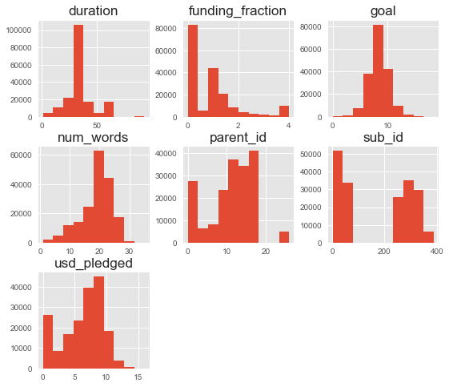
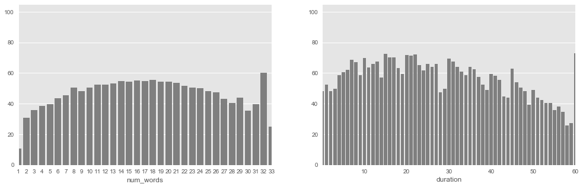

#  Kickstarter Projects - How to Invest Safely

## 1.)  Introduction and Background

Data from 209,222 projects downloaded from https://webrobots.io/kickstarter-datasets/.  This dataset provides many useful features, including campaign goal, duration, success/failure, category/subcategory, location, title, and associated URLS.

In future analysis, I hope to scrape further to include #images/videos, reward tier system, full project description, etc.

## 2.)  Hypothesis and Strategy

## 3.) Getting Started - Import Libraries, Basic Preprocessing

Data from 209,222 Kickstarter projects.  Data is scraped monthly and placed into a CSV for that given month.  Data can be downloaded from https://webrobots.io/kickstarter-datasets/ (last checked March 2019).

### Imported libraries for data loading, processing, training, and evaluation


```python
## ETL / Data Loading and Transforming ##
import numpy as np
import pandas as pd
import glob
import datetime as dt
import json
from ast import literal_eval

## Tools for Data Visualization ##
import matplotlib.pyplot as plt
import seaborn as sns
sns.set_palette('muted')

## Finally, for final Data Preparation, Model Training, and Model Evaluation ##
from sklearn import preprocessing
from sklearn.model_selection import train_test_split
from sklearn.ensemble import RandomForestClassifier
from sklearn.metrics import accuracy_score
from sklearn.metrics import confusion_matrix
from sklearn.metrics import roc_auc_score
from sklearn.metrics import classification_report

import warnings
warnings.filterwarnings('ignore')
```


```python
## Specifying path to 56 CSV files and loading them all into a single dataframe (~GB) ##

path = r'./Kickstarter Data/Kickstarter_2019-03-14T03_20_12_200Z'

campaigns = pd.concat((pd.read_csv(file) for file in glob.glob(path + "/*.csv")))

## A first look at our dataframe ##
campaigns.head(2)
```


<div>
<style scoped>
    .dataframe tbody tr th:only-of-type {
        vertical-align: middle;
    }

    .dataframe tbody tr th {
        vertical-align: top;
    }

    .dataframe thead th {
        text-align: right;
    }
</style>
<table border="1" class="dataframe">
  <thead>
    <tr style="text-align: right;">
      <th></th>
      <th>backers_count</th>
      <th>blurb</th>
      <th>category</th>
      <th>converted_pledged_amount</th>
      <th>country</th>
      <th>created_at</th>
      <th>creator</th>
      <th>currency</th>
      <th>currency_symbol</th>
      <th>currency_trailing_code</th>
      <th>...</th>
      <th>slug</th>
      <th>source_url</th>
      <th>spotlight</th>
      <th>staff_pick</th>
      <th>state</th>
      <th>state_changed_at</th>
      <th>static_usd_rate</th>
      <th>urls</th>
      <th>usd_pledged</th>
      <th>usd_type</th>
    </tr>
  </thead>
  <tbody>
    <tr>
      <th>0</th>
      <td>21</td>
      <td>2006 was almost 7 years ago.... Can you believ...</td>
      <td>{"id":43,"name":"Rock","slug":"music/rock","po...</td>
      <td>802</td>
      <td>US</td>
      <td>1387659690</td>
      <td>{"id":1495925645,"name":"Daniel","is_registere...</td>
      <td>USD</td>
      <td>$</td>
      <td>True</td>
      <td>...</td>
      <td>new-final-round-album</td>
      <td>https://www.kickstarter.com/discover/categorie...</td>
      <td>True</td>
      <td>False</td>
      <td>successful</td>
      <td>1391899046</td>
      <td>1.0</td>
      <td>{"web":{"project":"https://www.kickstarter.com...</td>
      <td>802.0</td>
      <td>international</td>
    </tr>
    <tr>
      <th>1</th>
      <td>97</td>
      <td>An adorable fantasy enamel pin series of princ...</td>
      <td>{"id":54,"name":"Mixed Media","slug":"art/mixe...</td>
      <td>2259</td>
      <td>US</td>
      <td>1549659768</td>
      <td>{"id":1175589980,"name":"Katherine","slug":"fr...</td>
      <td>USD</td>
      <td>$</td>
      <td>True</td>
      <td>...</td>
      <td>princess-pals-enamel-pin-series</td>
      <td>https://www.kickstarter.com/discover/categorie...</td>
      <td>True</td>
      <td>False</td>
      <td>successful</td>
      <td>1551801611</td>
      <td>1.0</td>
      <td>{"web":{"project":"https://www.kickstarter.com...</td>
      <td>2259.0</td>
      <td>international</td>
    </tr>
  </tbody>
</table>
<p>2 rows × 37 columns</p>
</div>


```python
campaigns.describe()
```


<div>
<style scoped>
    .dataframe tbody tr th:only-of-type {
        vertical-align: middle;
    }

    .dataframe tbody tr th {
        vertical-align: top;
    }

    .dataframe thead th {
        text-align: right;
    }
</style>
<table border="1" class="dataframe">
  <thead>
    <tr style="text-align: right;">
      <th></th>
      <th>backers_count</th>
      <th>converted_pledged_amount</th>
      <th>created_at</th>
      <th>deadline</th>
      <th>fx_rate</th>
      <th>goal</th>
      <th>id</th>
      <th>launched_at</th>
      <th>pledged</th>
      <th>state_changed_at</th>
      <th>static_usd_rate</th>
      <th>usd_pledged</th>
    </tr>
  </thead>
  <tbody>
    <tr>
      <th>count</th>
      <td>209222.000000</td>
      <td>2.092220e+05</td>
      <td>2.092220e+05</td>
      <td>2.092220e+05</td>
      <td>209222.000000</td>
      <td>2.092220e+05</td>
      <td>2.092220e+05</td>
      <td>2.092220e+05</td>
      <td>2.092220e+05</td>
      <td>2.092220e+05</td>
      <td>209222.000000</td>
      <td>2.092220e+05</td>
    </tr>
    <tr>
      <th>mean</th>
      <td>145.419057</td>
      <td>1.289290e+04</td>
      <td>1.456089e+09</td>
      <td>1.463033e+09</td>
      <td>0.994857</td>
      <td>4.917604e+04</td>
      <td>1.073222e+09</td>
      <td>1.460206e+09</td>
      <td>1.881403e+04</td>
      <td>1.462838e+09</td>
      <td>1.010757</td>
      <td>1.289213e+04</td>
    </tr>
    <tr>
      <th>std</th>
      <td>885.967976</td>
      <td>8.889414e+04</td>
      <td>6.339711e+07</td>
      <td>6.305618e+07</td>
      <td>0.211654</td>
      <td>1.179427e+06</td>
      <td>6.198051e+08</td>
      <td>6.309029e+07</td>
      <td>3.229596e+05</td>
      <td>6.290421e+07</td>
      <td>0.231893</td>
      <td>8.890124e+04</td>
    </tr>
    <tr>
      <th>min</th>
      <td>0.000000</td>
      <td>0.000000e+00</td>
      <td>1.240366e+09</td>
      <td>1.241334e+09</td>
      <td>0.008966</td>
      <td>1.000000e-02</td>
      <td>8.624000e+03</td>
      <td>1.240603e+09</td>
      <td>0.000000e+00</td>
      <td>1.241334e+09</td>
      <td>0.008771</td>
      <td>0.000000e+00</td>
    </tr>
    <tr>
      <th>25%</th>
      <td>4.000000</td>
      <td>1.060000e+02</td>
      <td>1.413317e+09</td>
      <td>1.420607e+09</td>
      <td>1.000000</td>
      <td>1.500000e+03</td>
      <td>5.351054e+08</td>
      <td>1.417639e+09</td>
      <td>1.100000e+02</td>
      <td>1.420485e+09</td>
      <td>1.000000</td>
      <td>1.060014e+02</td>
    </tr>
    <tr>
      <th>50%</th>
      <td>27.000000</td>
      <td>1.537000e+03</td>
      <td>1.457895e+09</td>
      <td>1.464754e+09</td>
      <td>1.000000</td>
      <td>5.000000e+03</td>
      <td>1.074579e+09</td>
      <td>1.461924e+09</td>
      <td>1.556000e+03</td>
      <td>1.464709e+09</td>
      <td>1.000000</td>
      <td>1.537358e+03</td>
    </tr>
    <tr>
      <th>75%</th>
      <td>89.000000</td>
      <td>6.548000e+03</td>
      <td>1.511595e+09</td>
      <td>1.519437e+09</td>
      <td>1.000000</td>
      <td>1.500000e+04</td>
      <td>1.609369e+09</td>
      <td>1.516694e+09</td>
      <td>6.887200e+03</td>
      <td>1.519366e+09</td>
      <td>1.000000</td>
      <td>6.550000e+03</td>
    </tr>
    <tr>
      <th>max</th>
      <td>105857.000000</td>
      <td>8.596474e+06</td>
      <td>1.552527e+09</td>
      <td>1.557721e+09</td>
      <td>1.876033</td>
      <td>1.000000e+08</td>
      <td>2.147476e+09</td>
      <td>1.552537e+09</td>
      <td>8.103074e+07</td>
      <td>1.552537e+09</td>
      <td>1.716408</td>
      <td>8.596475e+06</td>
    </tr>
  </tbody>
</table>
</div>


```python
print('The initial columns in our dataframe are: \n \n', list(campaigns.columns))
```

    The initial columns in our dataframe are: 
     
     ['backers_count', 'blurb', 'category', 'converted_pledged_amount', 'country', 'created_at', 'creator', 'currency', 'currency_symbol', 'currency_trailing_code', 'current_currency', 'deadline', 'disable_communication', 'friends', 'fx_rate', 'goal', 'id', 'is_backing', 'is_starrable', 'is_starred', 'launched_at', 'location', 'name', 'permissions', 'photo', 'pledged', 'profile', 'slug', 'source_url', 'spotlight', 'staff_pick', 'state', 'state_changed_at', 'static_usd_rate', 'urls', 'usd_pledged', 'usd_type']
    

### 4.)  Basic Data Processing

Workshopping the following columns: 

    1.)  Times are in UNIX format and must be converted to datetime
    2.)  Category, location, and creator_id must be extracted from JSON Dict ~ '{contents}'
           --> Can read string to get dict, but unexpected ""s in entries need to be dealt with separately. 

Note row 350 (id 1455233479) gave me a world of hurt because of "Kat "NomadiKat" Vallera".  Anyone who uses a nickname with quotes messes up the field \*__\*


```python
## Create duration column for number of days project had to acquire goal.  Convert UNIX to normal datetime. ##

campaigns['duration'] = pd.to_datetime(campaigns['deadline'], unit='s').sub(\
    pd.to_datetime(campaigns['launched_at'], unit='s')).dt.days
```

For now, I'll assign poorly behaved creator entries a creator_id of 0.  Will be easy enough to correct later, but mostly unique creators (157k/209k even with this assignment); thus this column is unlikely to be predictive and won't be used in the analysis.


```python
campaigns['creator'].map(lambda x: eval(x)['id'] if x not null else 'null')
```


      File "<ipython-input-710-262e9aa1d4a8>", line 1
        campaigns['creator'].map(lambda x: eval(x)['id'] if x not null else 'null')
                                                                     ^
    SyntaxError: invalid syntax
    


```python
campaigns['creator']
```


    0      {"id":1495925645,"name":"Daniel","is_registere...
    1      {"id":1175589980,"name":"Katherine","slug":"fr...
    2      {"id":1196856269,"name":"MelissaThomas","is_re...
    3      {"id":1569700626,"name":"WAO","slug":"wearewao...
    4      {"id":1870845385,"name":"Kalpit Jain","is_regi...
    5      {"id":385711367,"name":"Jennifer Hawkyard","sl...
    6      {"id":160498270,"name":"Maceo Paisley","slug":...
    7      {"id":1188856672,"name":"Mike Evans","slug":"l...
    8      {"id":164923417,"name":"Michael","is_registere...
    9      {"id":1561008747,"name":"Nathan Hatch","is_reg...
    10     {"id":213131014,"name":"Kris Vagner","slug":"k...
    11     {"id":1915255066,"name":"Tomas Borsa","is_regi...
    12     {"id":493945394,"name":"London Navy","is_regis...
    13     {"id":1840198615,"name":"Sabato Alterio","is_r...
    14     {"id":1300858528,"name":"Lauren","is_registere...
    15     {"id":350802947,"name":"Misha","is_registered"...
    16     {"id":1775187969,"name":"Michael White","is_re...
    17     {"id":1908392143,"name":"Harvey Wang","is_regi...
    18     {"id":950394853,"name":"Tyler Andrew Jones","i...
    19     {"id":394864250,"name":"The Secret Alley/Galal...
    20     {"id":1264664674,"name":"People Inside Electro...
    21     {"id":2127849147,"name":"Joe Head","is_registe...
    22     {"id":55344839,"name":"Tracy Jackson","is_regi...
    23     {"id":1517978659,"name":"Chad Arel","slug":"ch...
    24     {"id":917289185,"name":"Jeremy Secrest","is_re...
    25     {"id":815665254,"name":"Hodges & Loughrey","is...
    26     {"id":2005063261,"name":"Milica","is_registere...
    27     {"id":109948689,"name":"Aaron Simmons","slug":...
    28     {"id":1394832729,"name":"Winner Take All","slu...
    29     {"id":1869702845,"name":"Virginia Tech Symphon...
                                 ...                        
    935    {"id":1842571016,"name":"OpenElectrons.com","i...
    936    {"id":1752821920,"name":"Esoteric Trading Solu...
    937    {"id":1194822373,"name":"Michael","is_register...
    938    {"id":1458134548,"name":"Planetary Resources",...
    939    {"id":422934696,"name":"Sergey Knazev","is_reg...
    940    {"id":1893475112,"name":"Tony Cuevas","is_regi...
    941    {"id":1327883004,"name":"BigBands XL for Apple...
    942    {"id":93103919,"name":"Timbuktu Labs","slug":"...
    943    {"id":1384534766,"name":"QUS-Body Connected","...
    944    {"id":571117439,"name":"Aquacy Dive Watches","...
    945    {"id":925299561,"name":"Josh Folan","slug":"jo...
    946    {"id":1101850648,"name":"Dirty Goat Roadhouse ...
    947    {"id":574634967,"name":"Andrea","is_registered...
    948    {"id":745548258,"name":"ezOxygen","is_register...
    949    {"id":1799572177,"name":"Resonator","is_regist...
    950    {"id":1700151192,"name":"Mike Freland","is_reg...
    951    {"id":939229885,"name":"Misty Rae Carson","is_...
    952    {"id":165605832,"name":"Greg Wax","is_register...
    953    {"id":7807889,"name":"Alison Gabrielle","is_re...
    954    {"id":739922847,"name":"Brainard and Delia Car...
    955    {"id":2087896618,"name":"Circle Yoga Shala","i...
    956    {"id":499074752,"name":"Brian Darling","slug":...
    957    {"id":929731443,"name":"Samik Sil","is_registe...
    958    {"id":402192945,"name":"Erin Hartung (deleted)...
    959    {"id":1521374935,"name":"Cameron Cairnduff","i...
    960    {"id":86849824,"name":"Blane White","slug":"st...
    961    {"id":1899017630,"name":"Alan Wichert","is_reg...
    962    {"id":1589905505,"name":"T. Simms","slug":"1pr...
    963    {"id":1468696154,"name":"Alex Beene","is_regis...
    964    {"id":230724301,"name":"CPS Books / G2 Enterta...
    Name: creator, Length: 209222, dtype: object


```python
good_indicies = []
bad_indicies = []

for i in range(len(campaigns)):
    try:
        good_indicies.append(json.loads(campaigns['creator'].values[i])['id'])
    except ValueError:
        bad_indicies.append(i)
    else:
        continue
        
campaigns['creator'].iloc[bad_indicies] = '{"id": 0}'

campaigns['creator_id'] = campaigns['creator'].map(lambda x: json.loads(x)['id'])

## Quickly viewing creators associated with multiple projects. ##
(campaigns[campaigns['creator_id'] != 0].groupby(by = 'creator_id', as_index=True, group_keys=True))['id'].count().sort_values(ascending=False).head(5)
```


    creator_id
    2104052526    76
    1655558466    61
    957058942     59
    2039317553    56
    1323060510    55
    Name: id, dtype: int64


```python
## Initially dropped all duplicates of creator_id == 0 as they were pure copies, but this may not be the case

#duplicates = campaigns.drop_duplicates(['creator_id']).values[campaigns.groupby(by = 'creator_id', as_index=True, group_keys=True)['id'].count() > 1]

#duplicates_without_0 = duplicates[1:]
#duplicates_without_0 = duplicates_without_0[:,-1]

#campaigns.groupby(by = ['creator_id', 'id'], as_index=True, axis=0, group_keys=True).count()[repeat_creators]

#duplicate_table = campaigns[campaigns['creator_id'].isin(duplicates_without_0)]
#duplicate_table.sort_values('creator_id', ascending=False);
```

Now, extract other relevant information from dataframe, populating new columns that describe where and when a campaign was launched.  


```python
training_rough = campaigns.copy()

training_rough.rename(columns={'state' : 'status'}, inplace=True)

training_rough['sub_id'] = training_rough['category'].map(lambda x: json.loads(x)['id'])
list_of_dicts = training_rough['category'].apply(lambda x: eval(x))

parent_ids = []
rogue_indices = []

for i in range(len(list_of_dicts)):
    try:
        elem = list_of_dicts.ravel()[i]
        parent_ids.append(elem['parent_id'])
    except KeyError:
        rogue_indices.append(i)
        parent_ids.append(0)
    else:
        continue
        
training_rough = training_rough.assign(parent_id = parent_ids)
```


```python
training_rough['location'].fillna(value='{"name":"Unknown", "state": "Unknown"}', inplace=True)
training_rough['city'] = training_rough['location'].map(lambda x: json.loads(x)['name'])
training_rough['state'] = training_rough['location'].map(lambda x: json.loads(x)['state'])

dates = pd.to_datetime(training_rough['launched_at'], unit='s')

training_rough['weekday_launched'] = dates.map(lambda x: x.weekday())
training_rough['month_launched'] = dates.map(lambda x: x.month)
training_rough['year_launched'] = dates.map(lambda x: x.year)
training_rough['quarter'] = dates.map(lambda x: x.quarter)

training_rough['blurb'].fillna(value='None', inplace=True)

training_rough['num_words'] = training_rough['blurb'].map(lambda x: len(x.split()))
```

We added in num_words of the blub as an extra, albeit basic, feature.  We now dump off the uninteresting columns in preparation for visualization.


```python
kickstarter = training_rough.copy()

cols_to_keep = ['id', 'goal', 'backers_count', 'duration', 'creator_id', 'status', 'usd_pledged',\
                'parent_id', 'sub_id', 'num_words', 'city', 'state', 'weekday_launched', 'year_launched', 'month_launched', 'quarter']
kickstarter = kickstarter[cols_to_keep]
kickstarter = kickstarter.drop_duplicates('id', keep='last')
kickstarter.set_index('id', inplace=True)

kickstarter.goal.count()
```


    182264


### Brief Update and Discussion
Still Need To: 

    1) Handle duplicates, 
    4) Fix missing / mishandled values 
    6) Look into basic NLP to analyze the blurb, 7) Normalize and
        scale the data, 
    10) Critically analyze and improve those models with hyperparameter tuning

## 5.) Visualization of Kickstarter Data

Let's try to visualize project success based on various available features.


```python
counts = kickstarter.goal.groupby(kickstarter.status).count()
labels = counts.index
pct = 100 * counts / counts.sum()

fig, ax = plt.subplots(figsize=[5,5])
pathces, texts, autotexts = ax.pie(counts, autopct='%1.2f%%', pctdistance=.7, startangle=80, \
                                  explode=[0, 0, .25, 0, .5])

ax.axis('equal')
ax.legend(labels)
plt.tight_layout()
plt.show()
```


```python
successes = kickstarter[kickstarter['status'] == 'successful']
failures = kickstarter[(kickstarter['status'] == 'failed')]

success_by_category = successes.goal.groupby(successes.parent_id).count()
failure_by_category = failures.goal.groupby(failures.parent_id).count()
total_by_category = kickstarter.count()
```


```python
success_rate = []

for category in success_by_category.index:
    rate = success_by_category[category] / (success_by_category[category] + failure_by_category[category])
    success_rate.append(100*rate)
    
success_rate = pd.Series(success_rate, index=success_by_category.index)

sns.barplot(x=success_rate.index, y=success_rate)
plt.show()
```


```python
fig, ax1 = plt.subplots()
labels = success_by_category.index

p1 = sns.barplot(x=labels, y=success_by_category, color='#99ff69')
p2 = sns.barplot(x=labels, y=failure_by_category, bottom=success_by_category, color='#ff4960')

plt.ylabel('Number')
plt.xlabel('Category')
plt.show()
```





```python
vals = kickstarter['goal'].values
largest = vals.max()

sns.distplot(np.log(vals), bins=20, kde=False, norm_hist=True, kde_kws={'color':'k', 'alpha':0.4},\
             hist_kws={'color':'k', 'linewidth':2, 'alpha':.7})
plt.xlim([0,14])
plt.xlabel('Log of Goal in USD')
plt.show()
```


```python
plt.hist(np.log(successes['goal'].values), bins=20, normed=True, alpha=0.5, color='g', label='successes')
plt.hist(np.log(failures['goal'].values), bins=20, normed=True, alpha=0.4, color='r', label='failures')

plt.xlim([0,16])
plt.legend()
plt.show()
```


We see from the above that goals are smaller for projects that meet success, which is intuitive.  let's check out how they do as portion of goal.


```python
kickstarter['funding_fraction'] = kickstarter['usd_pledged'].div(kickstarter['goal'])
kickstarter['daily_goal'] = kickstarter['goal'].div(kickstarter['duration'])

sns.distplot(kickstarter['funding_fraction'][kickstarter['funding_fraction'] < 4].values, kde=False, bins=20)
plt.axvline(x=1, color='k', linestyle='--')

plt.xlim([0, 4])
plt.show()
```


```python
fig, ax = plt.subplots(1, 2, figsize=(12,5))

sns.distplot(kickstarter[(kickstarter['funding_fraction'] >= 0.0) & (kickstarter['funding_fraction'] < 1)] \
                    ['funding_fraction'].values,kde=False, bins=10, ax=ax[0])
ax[0].set_xlim([0,3])
sns.distplot(kickstarter[(kickstarter['funding_fraction'] >= 1) & (kickstarter['funding_fraction'] < 5)]['funding_fraction'].values, \
             kde=False, color='r', bins=25, ax=ax[0])
ax[0].axvline(1, color='k', linestyle='--')

sns.distplot(kickstarter[(kickstarter['funding_fraction'] >= 0.0) & (kickstarter['funding_fraction'] < 1)] \
                    ['funding_fraction'].values,kde=True, bins=25, ax=ax[1])

ax[1].set_xlim([0.1, 1])
ax[1].set_ylim([0, 1.5])
plt.show()

# consider log plot to emphasize bump
```


It seems that projects either get very little of their goal or are able to surpass it, which spikes past the halfway point.  At first pass, this is a binary problem: either you succeed or you fail.  Thus, we'll treat this as a problem in binary classification.

### Defining a few convenient functions


```python
def success_rate(df, col):
    
    """ {DataFrame, column} -> {Series}
    
    Takes in a dataframe and the column you wish to sort by and returns the rate of success for each value in that column.
    
    """
    
    mask_of_success = (df['status'] == 'successful')
    successes = df[mask_of_success]
    
    success_by_col = successes.goal.groupby(successes[col]).count()
    total_by_col = df.goal.groupby(df[col]).count()
    
    success_rate = []
    items = success_by_col.index
    
    for item in items:
        try:
            rate = success_by_col[item] / total_by_col[item]
            success_rate.append(100*rate)
        except KeyError:
            rate = 1
        
    success_rate = pd.Series(success_rate, index=items)
    
    return success_rate
```


```python
def histplot(suc_rate):
    
    sns.distplot(suc_rate, norm_hist=False, kde=False, bins=10)
    
    return plt.show()
```


```python
def barplot(suc_rate):
    
    """ {series} -> {bar plot}
    Takes in a series of success rates with category indicies and plots their discrete distributions in a barplot. #
    """
    fix, ax = plt.subplots()
    
    rates = suc_rate.values
    labels = suc_rate.index
    
    sns.barplot(x=labels, y=rates)
    
    for tick in ax.get_xticklabels():
        tick.set_rotation(45)
    
    plt.tight_layout()
    
    return plt.show()
```


```python
histplot(success_rate(kickstarter, 'duration'))
```


### Visualizing the Effects of Subcategory

I've been very curious about how a Kickstarer's subcategory influences its chances for success.  Board Games, for instance, appear to have a large, loyal following on Kickstarter and correspondingly high success rates.  Is this a more general trend that can inform and restrict which project categories are safe to support?


```python
barplot(success_rate(kickstarter, 'sub_id'))
```


```python
CODES = training_rough['category'].map(lambda x: json.loads(x)['id'])
SUBCATS = training_rough['category'].map(lambda x: json.loads(x)['name'])

sub_id_decoder = dict(zip(CODES, SUBCATS))
```


```python
top = success_rate(kickstarter, 'sub_id').sort_values(ascending=False)[:10]
top_index = top.index.map(lambda x: sub_id_decoder[x])

bot = success_rate(kickstarter, 'sub_id').sort_values(ascending=True)[1:11]
bot_index = bot.index.map(lambda x: sub_id_decoder[x])

#Notice that 'Web' has 2 different sub_ids that lead to it#
```


```python
fig, ax = plt.subplots(figsize=[10,4])
sns.barplot(top_index, top)

ax.set_ylim([90,100])

plt.show()
```


```python
bot = success_rate(kickstarter, 'sub_id').sort_values(ascending=True)[1:11]
bot_index = bot.index.map(lambda x: sub_id_decoder[x])

#Notice that 'Web' has 2 different sub_ids that lead to it#
```


```python
fig, ax = plt.subplots(figsize=[10,4])
sns.barplot(bot_index, bot)

ax.set_ylim([0, 20])

plt.show()
```


```python
kickstarter['sub'] = kickstarter['sub_id'].map(lambda x: sub_id_decoder[x])
```


```python
kickstarter[kickstarter['sub_id'].isin(top.index)].groupby('sub_id').mean()
```


<div>
<style scoped>
    .dataframe tbody tr th:only-of-type {
        vertical-align: middle;
    }

    .dataframe tbody tr th {
        vertical-align: top;
    }

    .dataframe thead th {
        text-align: right;
    }
</style>
<table border="1" class="dataframe">
  <thead>
    <tr style="text-align: right;">
      <th></th>
      <th>goal</th>
      <th>backers_count</th>
      <th>duration</th>
      <th>creator_id</th>
      <th>usd_pledged</th>
      <th>parent_id</th>
      <th>num_words</th>
      <th>weekday_launched</th>
      <th>year_launched</th>
      <th>month_launched</th>
      <th>funding_fraction</th>
      <th>daily_goal</th>
    </tr>
    <tr>
      <th>sub_id</th>
      <th></th>
      <th></th>
      <th></th>
      <th></th>
      <th></th>
      <th></th>
      <th></th>
      <th></th>
      <th></th>
      <th></th>
      <th></th>
      <th></th>
    </tr>
  </thead>
  <tbody>
    <tr>
      <th>6</th>
      <td>4653.083295</td>
      <td>64.905954</td>
      <td>30.887009</td>
      <td>1.073149e+09</td>
      <td>5150.976462</td>
      <td>0.0</td>
      <td>18.947226</td>
      <td>2.413396</td>
      <td>2013.025034</td>
      <td>6.018268</td>
      <td>1.286618</td>
      <td>171.180106</td>
    </tr>
    <tr>
      <th>15</th>
      <td>7778.520186</td>
      <td>131.639752</td>
      <td>31.197205</td>
      <td>1.094779e+09</td>
      <td>16504.027731</td>
      <td>0.0</td>
      <td>18.687888</td>
      <td>2.409938</td>
      <td>2015.149068</td>
      <td>5.962733</td>
      <td>1.836536</td>
      <td>245.899089</td>
    </tr>
    <tr>
      <th>17</th>
      <td>6986.783831</td>
      <td>64.203866</td>
      <td>29.548330</td>
      <td>1.184893e+09</td>
      <td>6115.021852</td>
      <td>0.0</td>
      <td>18.947276</td>
      <td>2.446397</td>
      <td>2016.321617</td>
      <td>5.859402</td>
      <td>1.276403</td>
      <td>232.420450</td>
    </tr>
    <tr>
      <th>30</th>
      <td>22796.610000</td>
      <td>229.811250</td>
      <td>32.125417</td>
      <td>1.071664e+09</td>
      <td>23838.314282</td>
      <td>11.0</td>
      <td>19.409167</td>
      <td>2.314167</td>
      <td>2016.035000</td>
      <td>6.448333</td>
      <td>5.473377</td>
      <td>725.047328</td>
    </tr>
    <tr>
      <th>32</th>
      <td>8022.962500</td>
      <td>65.103750</td>
      <td>28.475833</td>
      <td>1.041409e+09</td>
      <td>6312.870674</td>
      <td>11.0</td>
      <td>19.378333</td>
      <td>2.432917</td>
      <td>2015.753333</td>
      <td>5.907500</td>
      <td>1.371238</td>
      <td>274.184743</td>
    </tr>
    <tr>
      <th>37</th>
      <td>6642.144167</td>
      <td>109.533333</td>
      <td>31.091667</td>
      <td>1.053635e+09</td>
      <td>7988.863477</td>
      <td>14.0</td>
      <td>19.854167</td>
      <td>2.480000</td>
      <td>2014.770000</td>
      <td>6.280000</td>
      <td>6.611916</td>
      <td>222.089572</td>
    </tr>
    <tr>
      <th>40</th>
      <td>5446.576250</td>
      <td>102.814583</td>
      <td>30.434167</td>
      <td>1.073613e+09</td>
      <td>6669.952614</td>
      <td>14.0</td>
      <td>19.704583</td>
      <td>2.335000</td>
      <td>2014.179167</td>
      <td>6.470833</td>
      <td>7.164833</td>
      <td>183.147241</td>
    </tr>
    <tr>
      <th>43</th>
      <td>5933.778333</td>
      <td>97.293750</td>
      <td>32.167917</td>
      <td>1.089245e+09</td>
      <td>6872.888342</td>
      <td>14.0</td>
      <td>20.030417</td>
      <td>2.449167</td>
      <td>2014.393750</td>
      <td>6.402917</td>
      <td>36.328377</td>
      <td>191.183057</td>
    </tr>
    <tr>
      <th>47</th>
      <td>4051.043221</td>
      <td>96.035417</td>
      <td>30.899167</td>
      <td>1.050571e+09</td>
      <td>4897.709906</td>
      <td>18.0</td>
      <td>19.495833</td>
      <td>2.395833</td>
      <td>2014.581250</td>
      <td>6.302500</td>
      <td>2.053833</td>
      <td>132.547888</td>
    </tr>
    <tr>
      <th>48</th>
      <td>7454.520616</td>
      <td>155.197834</td>
      <td>31.526031</td>
      <td>1.059033e+09</td>
      <td>9921.912457</td>
      <td>18.0</td>
      <td>19.483549</td>
      <td>2.401499</td>
      <td>2014.654311</td>
      <td>6.301125</td>
      <td>1.884356</td>
      <td>249.229071</td>
    </tr>
  </tbody>
</table>
</div>


```python
kickstarter[kickstarter['sub_id'].isin(bot.index)].groupby('sub_id').mean()
```


<div>
<style scoped>
    .dataframe tbody tr th:only-of-type {
        vertical-align: middle;
    }

    .dataframe tbody tr th {
        vertical-align: top;
    }

    .dataframe thead th {
        text-align: right;
    }
</style>
<table border="1" class="dataframe">
  <thead>
    <tr style="text-align: right;">
      <th></th>
      <th>goal</th>
      <th>backers_count</th>
      <th>duration</th>
      <th>creator_id</th>
      <th>usd_pledged</th>
      <th>parent_id</th>
      <th>num_words</th>
      <th>weekday_launched</th>
      <th>year_launched</th>
      <th>month_launched</th>
      <th>funding_fraction</th>
      <th>daily_goal</th>
    </tr>
    <tr>
      <th>sub_id</th>
      <th></th>
      <th></th>
      <th></th>
      <th></th>
      <th></th>
      <th></th>
      <th></th>
      <th></th>
      <th></th>
      <th></th>
      <th></th>
      <th></th>
    </tr>
  </thead>
  <tbody>
    <tr>
      <th>265</th>
      <td>54970.367089</td>
      <td>11.955696</td>
      <td>33.680380</td>
      <td>1.091717e+09</td>
      <td>1407.627039</td>
      <td>9.0</td>
      <td>18.778481</td>
      <td>2.265823</td>
      <td>2015.610759</td>
      <td>6.227848</td>
      <td>0.233405</td>
      <td>1750.585453</td>
    </tr>
    <tr>
      <th>272</th>
      <td>41077.622500</td>
      <td>43.321250</td>
      <td>32.752917</td>
      <td>1.080565e+09</td>
      <td>2560.994883</td>
      <td>12.0</td>
      <td>19.392917</td>
      <td>2.444583</td>
      <td>2014.822917</td>
      <td>6.746667</td>
      <td>0.287438</td>
      <td>1508.041194</td>
    </tr>
    <tr>
      <th>291</th>
      <td>301875.533333</td>
      <td>48.928655</td>
      <td>35.481871</td>
      <td>1.155455e+09</td>
      <td>3987.150065</td>
      <td>11.0</td>
      <td>19.535673</td>
      <td>2.477193</td>
      <td>2015.726316</td>
      <td>6.513450</td>
      <td>0.547710</td>
      <td>6211.017191</td>
    </tr>
    <tr>
      <th>303</th>
      <td>377049.040834</td>
      <td>72.761946</td>
      <td>34.500434</td>
      <td>1.060631e+09</td>
      <td>8403.297633</td>
      <td>11.0</td>
      <td>19.832320</td>
      <td>2.539531</td>
      <td>2015.642919</td>
      <td>6.306690</td>
      <td>3.389536</td>
      <td>9503.019161</td>
    </tr>
    <tr>
      <th>311</th>
      <td>29791.990428</td>
      <td>19.649370</td>
      <td>35.474559</td>
      <td>1.058619e+09</td>
      <td>1907.285216</td>
      <td>10.0</td>
      <td>19.695214</td>
      <td>2.498237</td>
      <td>2015.618136</td>
      <td>6.115365</td>
      <td>1.275698</td>
      <td>885.980534</td>
    </tr>
    <tr>
      <th>343</th>
      <td>5775.088123</td>
      <td>13.363985</td>
      <td>31.300766</td>
      <td>1.079444e+09</td>
      <td>618.140978</td>
      <td>26.0</td>
      <td>18.229885</td>
      <td>2.431034</td>
      <td>2015.856322</td>
      <td>6.193487</td>
      <td>0.340067</td>
      <td>202.620822</td>
    </tr>
    <tr>
      <th>345</th>
      <td>19473.424084</td>
      <td>17.434555</td>
      <td>33.016455</td>
      <td>1.064919e+09</td>
      <td>1184.061884</td>
      <td>26.0</td>
      <td>18.902019</td>
      <td>2.409125</td>
      <td>2015.744951</td>
      <td>6.570681</td>
      <td>0.403309</td>
      <td>480.903948</td>
    </tr>
    <tr>
      <th>358</th>
      <td>18165.132420</td>
      <td>20.917808</td>
      <td>33.296804</td>
      <td>1.052665e+09</td>
      <td>1432.408762</td>
      <td>13.0</td>
      <td>19.529680</td>
      <td>2.347032</td>
      <td>2015.415525</td>
      <td>6.438356</td>
      <td>0.401967</td>
      <td>510.470036</td>
    </tr>
    <tr>
      <th>360</th>
      <td>520409.295652</td>
      <td>19.921739</td>
      <td>33.358696</td>
      <td>1.031567e+09</td>
      <td>1579.417516</td>
      <td>13.0</td>
      <td>20.054348</td>
      <td>2.482609</td>
      <td>2015.552174</td>
      <td>6.539130</td>
      <td>0.193604</td>
      <td>12988.128770</td>
    </tr>
    <tr>
      <th>361</th>
      <td>34301.867845</td>
      <td>39.635336</td>
      <td>34.052297</td>
      <td>1.091385e+09</td>
      <td>2857.085619</td>
      <td>13.0</td>
      <td>18.976678</td>
      <td>2.288339</td>
      <td>2015.665018</td>
      <td>6.364664</td>
      <td>0.278022</td>
      <td>937.139685</td>
    </tr>
  </tbody>
</table>
</div>


```python
barplot(success_rate(kickstarter, 'num_words'))
```


```python
kickstarter.groupby('num_words').count().tail()
```


<div>
<style scoped>
    .dataframe tbody tr th:only-of-type {
        vertical-align: middle;
    }

    .dataframe tbody tr th {
        vertical-align: top;
    }

    .dataframe thead th {
        text-align: right;
    }
</style>
<table border="1" class="dataframe">
  <thead>
    <tr style="text-align: right;">
      <th></th>
      <th>goal</th>
      <th>backers_count</th>
      <th>duration</th>
      <th>creator_id</th>
      <th>status</th>
      <th>usd_pledged</th>
      <th>parent_id</th>
      <th>sub_id</th>
      <th>city</th>
      <th>state</th>
      <th>weekday_launched</th>
      <th>year_launched</th>
      <th>month_launched</th>
      <th>funding_fraction</th>
      <th>daily_goal</th>
      <th>sub</th>
    </tr>
    <tr>
      <th>num_words</th>
      <th></th>
      <th></th>
      <th></th>
      <th></th>
      <th></th>
      <th></th>
      <th></th>
      <th></th>
      <th></th>
      <th></th>
      <th></th>
      <th></th>
      <th></th>
      <th></th>
      <th></th>
      <th></th>
    </tr>
  </thead>
  <tbody>
    <tr>
      <th>31</th>
      <td>48</td>
      <td>48</td>
      <td>48</td>
      <td>48</td>
      <td>48</td>
      <td>48</td>
      <td>48</td>
      <td>48</td>
      <td>48</td>
      <td>48</td>
      <td>48</td>
      <td>48</td>
      <td>48</td>
      <td>48</td>
      <td>48</td>
      <td>48</td>
    </tr>
    <tr>
      <th>32</th>
      <td>15</td>
      <td>15</td>
      <td>15</td>
      <td>15</td>
      <td>15</td>
      <td>15</td>
      <td>15</td>
      <td>15</td>
      <td>15</td>
      <td>15</td>
      <td>15</td>
      <td>15</td>
      <td>15</td>
      <td>15</td>
      <td>15</td>
      <td>15</td>
    </tr>
    <tr>
      <th>33</th>
      <td>4</td>
      <td>4</td>
      <td>4</td>
      <td>4</td>
      <td>4</td>
      <td>4</td>
      <td>4</td>
      <td>4</td>
      <td>4</td>
      <td>4</td>
      <td>4</td>
      <td>4</td>
      <td>4</td>
      <td>4</td>
      <td>4</td>
      <td>4</td>
    </tr>
    <tr>
      <th>34</th>
      <td>1</td>
      <td>1</td>
      <td>1</td>
      <td>1</td>
      <td>1</td>
      <td>1</td>
      <td>1</td>
      <td>1</td>
      <td>1</td>
      <td>1</td>
      <td>1</td>
      <td>1</td>
      <td>1</td>
      <td>1</td>
      <td>1</td>
      <td>1</td>
    </tr>
    <tr>
      <th>35</th>
      <td>1</td>
      <td>1</td>
      <td>1</td>
      <td>1</td>
      <td>1</td>
      <td>1</td>
      <td>1</td>
      <td>1</td>
      <td>1</td>
      <td>1</td>
      <td>1</td>
      <td>1</td>
      <td>1</td>
      <td>1</td>
      <td>1</td>
      <td>1</td>
    </tr>
  </tbody>
</table>
</div>


In the case of number of words, neglecting the single measurement for 34 and 35, we see a sweet-spot around 17 to 18 words -- not too long, not too short.


```python
suc = success_rate(kickstarter, 'city')
selection = ['Chicago', 'Los Angeles', 'Miami', 'San Francisco', 'Kansas City', 'South Bend', 'London']
sns.barplot(suc[selection].index, suc[selection].values)
plt.show()
```


```python
ks_success_agg_by_id = \
kickstarter[kickstarter['status']=='successful'].groupby(['parent_id', 'sub']).agg(['mean', 'count'])

ks_failure_agg_by_id = \
kickstarter[kickstarter['status']=='failed'].groupby(['parent_id', 'sub']).agg(['mean', 'count'])

ks_success_agg_by_id.query('10 < parent_id < 15').head(2)
```


<div>
<style scoped>
    .dataframe tbody tr th:only-of-type {
        vertical-align: middle;
    }

    .dataframe tbody tr th {
        vertical-align: top;
    }

    .dataframe thead tr th {
        text-align: left;
    }

    .dataframe thead tr:last-of-type th {
        text-align: right;
    }
</style>
<table border="1" class="dataframe">
  <thead>
    <tr>
      <th></th>
      <th></th>
      <th colspan="2" halign="left">goal</th>
      <th colspan="2" halign="left">backers_count</th>
      <th colspan="2" halign="left">duration</th>
      <th colspan="2" halign="left">creator_id</th>
      <th colspan="2" halign="left">usd_pledged</th>
      <th>...</th>
      <th colspan="2" halign="left">weekday_launched</th>
      <th colspan="2" halign="left">year_launched</th>
      <th colspan="2" halign="left">month_launched</th>
      <th colspan="2" halign="left">funding_fraction</th>
      <th colspan="2" halign="left">daily_goal</th>
    </tr>
    <tr>
      <th></th>
      <th></th>
      <th>mean</th>
      <th>count</th>
      <th>mean</th>
      <th>count</th>
      <th>mean</th>
      <th>count</th>
      <th>mean</th>
      <th>count</th>
      <th>mean</th>
      <th>count</th>
      <th>...</th>
      <th>mean</th>
      <th>count</th>
      <th>mean</th>
      <th>count</th>
      <th>mean</th>
      <th>count</th>
      <th>mean</th>
      <th>count</th>
      <th>mean</th>
      <th>count</th>
    </tr>
    <tr>
      <th>parent_id</th>
      <th>sub</th>
      <th></th>
      <th></th>
      <th></th>
      <th></th>
      <th></th>
      <th></th>
      <th></th>
      <th></th>
      <th></th>
      <th></th>
      <th></th>
      <th></th>
      <th></th>
      <th></th>
      <th></th>
      <th></th>
      <th></th>
      <th></th>
      <th></th>
      <th></th>
      <th></th>
    </tr>
  </thead>
  <tbody>
    <tr>
      <th rowspan="2" valign="top">11</th>
      <th>Action</th>
      <td>12673.057554</td>
      <td>139</td>
      <td>256.266187</td>
      <td>139</td>
      <td>29.330935</td>
      <td>139</td>
      <td>1.163739e+09</td>
      <td>139</td>
      <td>18129.921694</td>
      <td>139</td>
      <td>...</td>
      <td>2.532374</td>
      <td>139</td>
      <td>2015.985612</td>
      <td>139</td>
      <td>6.582734</td>
      <td>139</td>
      <td>3.063462</td>
      <td>139</td>
      <td>422.988053</td>
      <td>139</td>
    </tr>
    <tr>
      <th>Animation</th>
      <td>50004.903599</td>
      <td>778</td>
      <td>404.080977</td>
      <td>778</td>
      <td>33.469152</td>
      <td>778</td>
      <td>1.111975e+09</td>
      <td>778</td>
      <td>30831.754661</td>
      <td>778</td>
      <td>...</td>
      <td>2.312339</td>
      <td>778</td>
      <td>2014.159383</td>
      <td>778</td>
      <td>6.209512</td>
      <td>778</td>
      <td>9.384973</td>
      <td>778</td>
      <td>1528.041429</td>
      <td>778</td>
    </tr>
  </tbody>
</table>
<p>2 rows × 24 columns</p>
</div>


```python
#parent_id_decoder = {'0': 'Miscellaneous', '11': 'Film', '12': 'Games', '13': 'Media', '14': Music, }
```


```python
suc = success_rate(kickstarter[kickstarter['parent_id'] == 12], 'sub').sort_values()
labels = suc.index
values = suc.values

barplot(suc)
```





Below we can see the success rate for various subcategories belonging to the same parent_id associated with Films


```python
suc = success_rate(kickstarter[kickstarter['parent_id'] == 11], 'sub').sort_values()
labels = suc.index
values = suc.values

barplot(suc)
```


```python
fix, ax1 = plt.subplots(figsize=[10,4])
ax2 = ax1.twinx()
    
suc = success_rate(kickstarter[kickstarter['parent_id'] == 11], 'sub')
labels = suc.index
values = suc.values
mean_goal = kickstarter[kickstarter.parent_id == 11].groupby('sub').agg('mean')['goal']
    
sns.barplot(x=labels, y=values, ax=ax1)
ax2.plot(mean_goal.index, mean_goal.values, marker='o', linestyle='dashed', color='k', label='Mean Goal')
    
for tick in ax1.get_xticklabels():
        tick.set_rotation(45)
        
ax1.set_xlabel('')
ax1.set_ylabel('Success Rate (%)')
ax2.set_ylabel('Mean Funding Goal (1000 USD)')
ax2.set_yticklabels(['0', '200', '400', '600', '800', '1000'], minor=False)

plt.tight_layout()
plt.show()
```


```python
fix, ax1 = plt.subplots(figsize=[10,4])
ax2 = ax1.twinx()
    
suc = success_rate(kickstarter[kickstarter['parent_id'] == 11], 'sub').sort_values()
labels = suc.index
values = suc.values
sorter = dict(zip(labels, mean_goal.index))
mean_goal = kickstarter[kickstarter.parent_id == 11].groupby('sub').agg('mean')['goal']
    
sns.barplot(x=labels, y=values, ax=ax1)
mean_goal.index = mean_goal.map(lambda x: sorted[x])
ax2.plot(mean_goal.index, mean_goal.values, marker='o', linestyle='dashed', color='k', label='Mean Goal')
    
for tick in ax1.get_xticklabels():
        tick.set_rotation(45)
        
ax1.set_xlabel('')
ax1.set_ylabel('Success Rate (%)')
ax2.set_ylabel('Mean Funding Goal (1000 USD)')
ax2.set_yticklabels(['0', '200', '400', '600', '800', '1000'], minor=False)

plt.tight_layout()
plt.show()
```


    ---------------------------------------------------------------------------

    TypeError                                 Traceback (most recent call last)

    <ipython-input-836-fc733d2adf80> in <module>
          9 
         10 sns.barplot(x=labels, y=values, ax=ax1)
    ---> 11 mean_goal.index = mean_goal.index.map(lambda x: sorted[x])
         12 ax2.plot(mean_goal.index, mean_goal.values, marker='o', linestyle='dashed', color='k', label='Mean Goal')
         13 
    

    ~\Anaconda3\lib\site-packages\pandas\core\indexes\base.py in map(self, mapper, na_action)
       4516         from .multi import MultiIndex
       4517         new_values = super(Index, self)._map_values(
    -> 4518             mapper, na_action=na_action)
       4519 
       4520         attributes = self._get_attributes_dict()
    

    ~\Anaconda3\lib\site-packages\pandas\core\base.py in _map_values(self, mapper, na_action)
       1216 
       1217         # mapper is a function
    -> 1218         new_values = map_f(values, mapper)
       1219 
       1220         return new_values
    

    pandas/_libs/lib.pyx in pandas._libs.lib.map_infer()
    

    <ipython-input-836-fc733d2adf80> in <lambda>(x)
          9 
         10 sns.barplot(x=labels, y=values, ax=ax1)
    ---> 11 mean_goal.index = mean_goal.index.map(lambda x: sorted[x])
         12 ax2.plot(mean_goal.index, mean_goal.values, marker='o', linestyle='dashed', color='k', label='Mean Goal')
         13 
    

    TypeError: 'builtin_function_or_method' object is not subscriptable


# Now it's time to scale, normalize, and encode categorical variables


```python
multiple_creator_ids_mask = kickstarter.goal.groupby(kickstarter['creator_id']).count() > 1
kickstarter[kickstarter['creator_id'].isin(multiple_creator_ids_mask)]['creator_id'].nunique()
```


    1


Note that removing all id duplicates (repeat entries) also removed all extra copies of creator_id (with the exception of creator_id 0 which is just an unlabeled creator).  Since it is unique for every data entry, creator_id cannot be predictive so we drop it from our categories.

What about number of backers per month per category?  Is it constant?  Is a rate constant?  Are you competing against your own category?


```python
df_ks = kickstarter.copy()
df_ks = df_ks[df_ks['status'] != 'live']
drop_cols = ['creator_id']
df_ks.drop(columns=drop_cols, inplace=True)
df_ks['status'] = df_ks['status'].apply(lambda x: 1 if x == 'successful' else 0)
#df_ks = df_ks.reset_index().drop(columns='id')
```

Rename backers and impute 0 values as 1 so we can do division without trouble.


```python
df_ks.rename(columns={"backers_count":"backers", "usd_pledged": "pledged"}, inplace=True)
df_ks.loc[df_ks['backers'] == 0, 'backers'] = 1

df_ks.loc[:, 'pledge_per_backer'] = df_ks['pledged'] / df_ks['backers']
```

Create two new columns that place project goal and duration into bins based on the subcategory's distribution.  The last duplicates drop is necessary to get rid of repeated bin edges.


```python
df_ks['goal_pct_by_subcat'] = df_ks.groupby(['sub'])['goal'].transform(lambda x: pd.qcut(x, 3, labels=[1,2,3]))

df_ks['duration_by_subcat'] = df_ks.groupby(['sub'])['duration'].transform(lambda x: pd.qcut(x, 3, labels=False, duplicates='drop'))
```

Will continue with just a few more engineered metrics to help form the relations: competitors/quarter, competitors/launch month, and avg pledged / backer and success rate per goal, etc in year.

We start by forming the avg number of competitors by month/year for the subcategories in the same goal bucket:


```python
competitors_monthly = df_ks.groupby(['sub', 'month_launched', \
                                      'year_launched', 'goal_pct_by_subcat']).count()

competitors_monthly = competitors_monthly[['status']]
competitors_monthly.reset_index(inplace=True)
competitors_monthly.columns = ['sub', 'month_launched','year_launched', \
                               'goal_pct_by_subcat', 'competitors_monthly']
```


```python
avg_pledge_by_goal = pd.DataFrame(df_ks.groupby(['sub', 'year_launched', 'goal_pct_by_subcat'])\
                          ['pledge_per_backer', 'funding_fraction'].mean())
avg_pledge_by_goal.reset_index(inplace=True)
avg_pledge_by_goal.columns = ['sub', 'year_launched', 'goal_pct_by_subcat', 'avg_ppb', 'avg_fraction_goal']
```

Do same thing but based on duration bin rather than goal_amt bin


```python
avg_pledge_by_duration = pd.DataFrame(df_ks.groupby(['sub', 'year_launched', 'duration_by_subcat'])\
                          ['funding_fraction'].mean())
avg_pledge_by_duration.reset_index(inplace=True)
avg_pledge_by_duration.columns = ['sub', 'year_launched', 'duration_by_subcat', 'avg_fraction_dur']
```

Finally, let's create a reference subcategory average goal so that project goal ambition can be inferred


```python
avg_goal = pd.DataFrame(df_ks.groupby(['sub', 'year_launched', 'duration_by_subcat'])['goal'].mean().astype(int))
avg_goal.reset_index(inplace=True)
avg_goal.columns = ['sub', 'year_launched', 'duration_by_subcat', 'avg_goal']
```


```python
df_ks['log_goal'] = np.log1p(df_ks['goal'])

df_ks.shape
```


    (178226, 21)


Merging the newly constructed dataframes with the original


```python
df_ks = pd.merge(df_ks, competitors_monthly, on = \
                ['sub', 'year_launched', 'month_launched', 'goal_pct_by_subcat'], how= 'left')

df_ks = pd.merge(df_ks, avg_pledge_by_goal, on = ['sub', 'year_launched', 'goal_pct_by_subcat'], how='left')

df_ks = pd.merge(df_ks,avg_pledge_by_duration, on = ['sub', 'year_launched', 'duration_by_subcat'], how='left')

df_ks = pd.merge(df_ks, avg_goal, on=['sub', 'year_launched', 'duration_by_subcat'], how='left')
```


```python
df_ks_copy1 = df_ks.copy()
df_ks_copy2 = df_ks.copy()
```


```python
cols_to_drop = ['backers', 'pledged', 'state', 'city', 'pledge_per_backer', 'sub', 'funding_fraction']

df_ks.drop(cols_to_drop, axis=1, inplace=True)
#df_ks.drop(['funding_fraction'], axis=1, inplace=True)
```


```python
df_ks_1h = pd.get_dummies(df_ks, prefix=['parent_id', 'sub_id'], \
                         columns=['parent_id', 'sub_id'])

features = list(df_ks_1h)
features.remove('status')
target = ['status']
```


```python
df_ks_1h_scaled = pd.DataFrame(preprocessing.normalize(df_ks_1h[features]))
df_ks_1h_scaled.columns = list(df_ks_1h[features])
```


```python
df_ks_1h_scaled.head()
```


<div>
<style scoped>
    .dataframe tbody tr th:only-of-type {
        vertical-align: middle;
    }

    .dataframe tbody tr th {
        vertical-align: top;
    }

    .dataframe thead th {
        text-align: right;
    }
</style>
<table border="1" class="dataframe">
  <thead>
    <tr style="text-align: right;">
      <th></th>
      <th>goal</th>
      <th>duration</th>
      <th>num_words</th>
      <th>weekday_launched</th>
      <th>year_launched</th>
      <th>month_launched</th>
      <th>quarter</th>
      <th>daily_goal</th>
      <th>goal_pct_by_subcat</th>
      <th>duration_by_subcat</th>
      <th>...</th>
      <th>sub_id_357</th>
      <th>sub_id_358</th>
      <th>sub_id_359</th>
      <th>sub_id_360</th>
      <th>sub_id_361</th>
      <th>sub_id_362</th>
      <th>sub_id_386</th>
      <th>sub_id_387</th>
      <th>sub_id_388</th>
      <th>sub_id_389</th>
    </tr>
  </thead>
  <tbody>
    <tr>
      <th>0</th>
      <td>0.036296</td>
      <td>0.008167</td>
      <td>0.004718</td>
      <td>0.000363</td>
      <td>0.365316</td>
      <td>0.002178</td>
      <td>0.000726</td>
      <td>0.000807</td>
      <td>0.000181</td>
      <td>0.000181</td>
      <td>...</td>
      <td>0.0</td>
      <td>0.0</td>
      <td>0.0</td>
      <td>0.0</td>
      <td>0.0</td>
      <td>0.0</td>
      <td>0.0</td>
      <td>0.0</td>
      <td>0.0</td>
      <td>0.0</td>
    </tr>
    <tr>
      <th>1</th>
      <td>0.005087</td>
      <td>0.000153</td>
      <td>0.000112</td>
      <td>0.000000</td>
      <td>0.010251</td>
      <td>0.000015</td>
      <td>0.000005</td>
      <td>0.000170</td>
      <td>0.000005</td>
      <td>0.000000</td>
      <td>...</td>
      <td>0.0</td>
      <td>0.0</td>
      <td>0.0</td>
      <td>0.0</td>
      <td>0.0</td>
      <td>0.0</td>
      <td>0.0</td>
      <td>0.0</td>
      <td>0.0</td>
      <td>0.0</td>
    </tr>
    <tr>
      <th>2</th>
      <td>0.347254</td>
      <td>0.000174</td>
      <td>0.000382</td>
      <td>0.000017</td>
      <td>0.034968</td>
      <td>0.000191</td>
      <td>0.000069</td>
      <td>0.034725</td>
      <td>0.000035</td>
      <td>0.000000</td>
      <td>...</td>
      <td>0.0</td>
      <td>0.0</td>
      <td>0.0</td>
      <td>0.0</td>
      <td>0.0</td>
      <td>0.0</td>
      <td>0.0</td>
      <td>0.0</td>
      <td>0.0</td>
      <td>0.0</td>
    </tr>
    <tr>
      <th>3</th>
      <td>0.837298</td>
      <td>0.001732</td>
      <td>0.000982</td>
      <td>0.000173</td>
      <td>0.116182</td>
      <td>0.000520</td>
      <td>0.000173</td>
      <td>0.027910</td>
      <td>0.000173</td>
      <td>0.000000</td>
      <td>...</td>
      <td>0.0</td>
      <td>0.0</td>
      <td>0.0</td>
      <td>0.0</td>
      <td>0.0</td>
      <td>0.0</td>
      <td>0.0</td>
      <td>0.0</td>
      <td>0.0</td>
      <td>0.0</td>
    </tr>
    <tr>
      <th>4</th>
      <td>0.588627</td>
      <td>0.001825</td>
      <td>0.000530</td>
      <td>0.000059</td>
      <td>0.118667</td>
      <td>0.000353</td>
      <td>0.000118</td>
      <td>0.018988</td>
      <td>0.000177</td>
      <td>0.000059</td>
      <td>...</td>
      <td>0.0</td>
      <td>0.0</td>
      <td>0.0</td>
      <td>0.0</td>
      <td>0.0</td>
      <td>0.0</td>
      <td>0.0</td>
      <td>0.0</td>
      <td>0.0</td>
      <td>0.0</td>
    </tr>
  </tbody>
</table>
<p>5 rows × 201 columns</p>
</div>


# Training a Random Forest Classifier


```python
X_train, X_test, y_train, y_test = train_test_split(df_ks_1h_scaled[features], df_ks_1h[target])
```


```python
clf = RandomForestClassifier(n_estimators = 50, criterion = 'gini',\
max_depth = 20, max_features=12)

clf.fit(X_train, y_train);
```


```python
y_train_pred = clf.predict(X_train)
y_test_pred = clf.predict(X_test)
```


```python
print('train accuracy is', accuracy_score(y_train, y_train_pred) \
      ,'and test accuracy is', accuracy_score(y_test, y_test_pred))
```

    train accuracy is 0.8484016488490226 and test accuracy is 0.7873061471822609
    


```python
feat_importance = pd.DataFrame(list(zip(features, clf.feature_importances_)))

feat_importance.sort_values(1, ascending=False).head()
```


<div>
<style scoped>
    .dataframe tbody tr th:only-of-type {
        vertical-align: middle;
    }

    .dataframe tbody tr th {
        vertical-align: top;
    }

    .dataframe thead th {
        text-align: right;
    }
</style>
<table border="1" class="dataframe">
  <thead>
    <tr style="text-align: right;">
      <th></th>
      <th>0</th>
      <th>1</th>
    </tr>
  </thead>
  <tbody>
    <tr>
      <th>12</th>
      <td>avg_fraction_goal</td>
      <td>0.134247</td>
    </tr>
    <tr>
      <th>13</th>
      <td>avg_fraction_dur</td>
      <td>0.131903</td>
    </tr>
    <tr>
      <th>11</th>
      <td>avg_ppb</td>
      <td>0.129156</td>
    </tr>
    <tr>
      <th>9</th>
      <td>log_goal</td>
      <td>0.049443</td>
    </tr>
    <tr>
      <th>4</th>
      <td>year_launched</td>
      <td>0.046349</td>
    </tr>
  </tbody>
</table>
</div>


Now we need to scan parameters to optimize our Random Forest and then use a more formal method for determining feature importance (SHAP, permutation, etc)


```python
from sklearn.linear_model import SGDClassifier
from sklearn.model_selection import GridSearchCV

sgd = SGDClassifier(loss="hinge", penalty="elasticnet", max_iter=50)
parameters = {'alpha' : [.1, .01, .001, .0001, .00001, .000001]}
clf = GridSearchCV(sgd, parameters, cv=5)
clf.fit(X_train, y_train)

sorted(clf.cv_results_.keys())
```


    ['mean_fit_time',
     'mean_score_time',
     'mean_test_score',
     'mean_train_score',
     'param_alpha',
     'params',
     'rank_test_score',
     'split0_test_score',
     'split0_train_score',
     'split1_test_score',
     'split1_train_score',
     'split2_test_score',
     'split2_train_score',
     'split3_test_score',
     'split3_train_score',
     'split4_test_score',
     'split4_train_score',
     'std_fit_time',
     'std_score_time',
     'std_test_score',
     'std_train_score']


```python
clf.get_params()
```


    {'cv': 5,
     'error_score': 'raise-deprecating',
     'estimator__alpha': 0.0001,
     'estimator__average': False,
     'estimator__class_weight': None,
     'estimator__early_stopping': False,
     'estimator__epsilon': 0.1,
     'estimator__eta0': 0.0,
     'estimator__fit_intercept': True,
     'estimator__l1_ratio': 0.15,
     'estimator__learning_rate': 'optimal',
     'estimator__loss': 'hinge',
     'estimator__max_iter': 50,
     'estimator__n_iter': None,
     'estimator__n_iter_no_change': 5,
     'estimator__n_jobs': None,
     'estimator__penalty': 'elasticnet',
     'estimator__power_t': 0.5,
     'estimator__random_state': None,
     'estimator__shuffle': True,
     'estimator__tol': None,
     'estimator__validation_fraction': 0.1,
     'estimator__verbose': 0,
     'estimator__warm_start': False,
     'estimator': SGDClassifier(alpha=0.0001, average=False, class_weight=None,
            early_stopping=False, epsilon=0.1, eta0=0.0, fit_intercept=True,
            l1_ratio=0.15, learning_rate='optimal', loss='hinge', max_iter=50,
            n_iter=None, n_iter_no_change=5, n_jobs=None, penalty='elasticnet',
            power_t=0.5, random_state=None, shuffle=True, tol=None,
            validation_fraction=0.1, verbose=0, warm_start=False),
     'fit_params': None,
     'iid': 'warn',
     'n_jobs': None,
     'param_grid': {'alpha': [0.1, 0.01, 0.001, 0.0001, 1e-05, 1e-06]},
     'pre_dispatch': '2*n_jobs',
     'refit': True,
     'return_train_score': 'warn',
     'scoring': None,
     'verbose': 0}


```python
y_train_pred = clf.predict(X_train)
y_test_pred = clf.predict(X_test)

print('train accuracy is', accuracy_score(y_train, y_train_pred) \
      ,'and test accuracy is', accuracy_score(y_test, y_test_pred))
```

    train accuracy is 0.6765966678885905 and test accuracy is 0.6777386269273066
    

# Better Random Forest Model (no one-hot encoding)

I try this again without one-hot encoding, which likely hurts tree-based methods


```python
dropping = ['backers', 'pledged', 'state', 'pledge_per_backer', 'sub', 'city', 'funding_fraction']

df_ks_copy1.drop(dropping, axis=1, inplace=True)

y = df_ks_copy1['status']
X = df_ks_copy1.drop('status', axis=1)

X_train, X_test, y_train, y_test = train_test_split(X, y)
```


```python
clf = RandomForestClassifier(n_estimators = 50, criterion = 'gini',\
max_depth = 10, max_features=5)

RFModel = clf.fit(X_train, y_train)

y_train_pred = clf.predict(X_train)
y_test_pred = clf.predict(X_test)

print('train accuracy is', accuracy_score(y_train, y_train_pred) \
      ,'and test accuracy is', accuracy_score(y_test, y_test_pred))
```

    train accuracy is 0.8062677210123514 and test accuracy is 0.7908970532127387
    

The naive feature importance from our Random Forest Model is given as follows:


```python
feat_importance = pd.DataFrame(list(zip(X, clf.feature_importances_)))

feat_importance.sort_values(1, ascending=False)
```


<div>
<style scoped>
    .dataframe tbody tr th:only-of-type {
        vertical-align: middle;
    }

    .dataframe tbody tr th {
        vertical-align: top;
    }

    .dataframe thead th {
        text-align: right;
    }
</style>
<table border="1" class="dataframe">
  <thead>
    <tr style="text-align: right;">
      <th></th>
      <th>0</th>
      <th>1</th>
    </tr>
  </thead>
  <tbody>
    <tr>
      <th>15</th>
      <td>avg_fraction_goal</td>
      <td>0.355559</td>
    </tr>
    <tr>
      <th>16</th>
      <td>avg_fraction_dur</td>
      <td>0.225389</td>
    </tr>
    <tr>
      <th>3</th>
      <td>sub_id</td>
      <td>0.150729</td>
    </tr>
    <tr>
      <th>17</th>
      <td>avg_goal</td>
      <td>0.060796</td>
    </tr>
    <tr>
      <th>14</th>
      <td>avg_ppb</td>
      <td>0.043181</td>
    </tr>
    <tr>
      <th>0</th>
      <td>goal</td>
      <td>0.028945</td>
    </tr>
    <tr>
      <th>2</th>
      <td>parent_id</td>
      <td>0.025646</td>
    </tr>
    <tr>
      <th>12</th>
      <td>log_goal</td>
      <td>0.024277</td>
    </tr>
    <tr>
      <th>9</th>
      <td>daily_goal</td>
      <td>0.019633</td>
    </tr>
    <tr>
      <th>1</th>
      <td>duration</td>
      <td>0.017192</td>
    </tr>
    <tr>
      <th>6</th>
      <td>year_launched</td>
      <td>0.016262</td>
    </tr>
    <tr>
      <th>13</th>
      <td>competitors_monthly</td>
      <td>0.011732</td>
    </tr>
    <tr>
      <th>4</th>
      <td>num_words</td>
      <td>0.005475</td>
    </tr>
    <tr>
      <th>7</th>
      <td>month_launched</td>
      <td>0.003758</td>
    </tr>
    <tr>
      <th>10</th>
      <td>goal_pct_by_subcat</td>
      <td>0.003679</td>
    </tr>
    <tr>
      <th>5</th>
      <td>weekday_launched</td>
      <td>0.003289</td>
    </tr>
    <tr>
      <th>11</th>
      <td>duration_by_subcat</td>
      <td>0.002841</td>
    </tr>
    <tr>
      <th>8</th>
      <td>quarter</td>
      <td>0.001620</td>
    </tr>
  </tbody>
</table>
</div>


More robustly, we use permutation importance to better assess feature importance.  This will essentially take into account the effect of mixing up feature values.  The more predictive features should be highly sensitive to interchanging arbitrary rows/entries.


```python
import eli5
from eli5.sklearn import PermutationImportance

perm = PermutationImportance(RFModel, random_state=1).fit(X_test, y_test)
eli5.show_weights(perm, feature_names = X_test.columns.tolist())
```


    <style>
    table.eli5-weights tr:hover {
        filter: brightness(85%);
    }
</style>


    

    

    

    

    

    


    

    

    

    

    

    


    

    

    

    

    
        <table class="eli5-weights eli5-feature-importances" style="border-collapse: collapse; border: none; margin-top: 0em; table-layout: auto;">
    <thead>
    <tr style="border: none;">
        <th style="padding: 0 1em 0 0.5em; text-align: right; border: none;">Weight</th>
        <th style="padding: 0 0.5em 0 0.5em; text-align: left; border: none;">Feature</th>
    </tr>
    </thead>
    <tbody>
    
        <tr style="background-color: hsl(120, 100.00%, 80.00%); border: none;">
            <td style="padding: 0 1em 0 0.5em; text-align: right; border: none;">
                0.1345
                
                    &plusmn; 0.0035
                
            </td>
            <td style="padding: 0 0.5em 0 0.5em; text-align: left; border: none;">
                avg_fraction_goal
            </td>
        </tr>
    
        <tr style="background-color: hsl(120, 100.00%, 90.68%); border: none;">
            <td style="padding: 0 1em 0 0.5em; text-align: right; border: none;">
                0.0452
                
                    &plusmn; 0.0018
                
            </td>
            <td style="padding: 0 0.5em 0 0.5em; text-align: left; border: none;">
                avg_fraction_dur
            </td>
        </tr>
    
        <tr style="background-color: hsl(120, 100.00%, 96.45%); border: none;">
            <td style="padding: 0 1em 0 0.5em; text-align: right; border: none;">
                0.0114
                
                    &plusmn; 0.0023
                
            </td>
            <td style="padding: 0 0.5em 0 0.5em; text-align: left; border: none;">
                sub_id
            </td>
        </tr>
    
        <tr style="background-color: hsl(120, 100.00%, 96.84%); border: none;">
            <td style="padding: 0 1em 0 0.5em; text-align: right; border: none;">
                0.0096
                
                    &plusmn; 0.0019
                
            </td>
            <td style="padding: 0 0.5em 0 0.5em; text-align: left; border: none;">
                avg_ppb
            </td>
        </tr>
    
        <tr style="background-color: hsl(120, 100.00%, 97.59%); border: none;">
            <td style="padding: 0 1em 0 0.5em; text-align: right; border: none;">
                0.0065
                
                    &plusmn; 0.0010
                
            </td>
            <td style="padding: 0 0.5em 0 0.5em; text-align: left; border: none;">
                avg_goal
            </td>
        </tr>
    
        <tr style="background-color: hsl(120, 100.00%, 98.36%); border: none;">
            <td style="padding: 0 1em 0 0.5em; text-align: right; border: none;">
                0.0038
                
                    &plusmn; 0.0002
                
            </td>
            <td style="padding: 0 0.5em 0 0.5em; text-align: left; border: none;">
                year_launched
            </td>
        </tr>
    
        <tr style="background-color: hsl(120, 100.00%, 98.41%); border: none;">
            <td style="padding: 0 1em 0 0.5em; text-align: right; border: none;">
                0.0036
                
                    &plusmn; 0.0009
                
            </td>
            <td style="padding: 0 0.5em 0 0.5em; text-align: left; border: none;">
                duration
            </td>
        </tr>
    
        <tr style="background-color: hsl(120, 100.00%, 98.82%); border: none;">
            <td style="padding: 0 1em 0 0.5em; text-align: right; border: none;">
                0.0023
                
                    &plusmn; 0.0010
                
            </td>
            <td style="padding: 0 0.5em 0 0.5em; text-align: left; border: none;">
                goal
            </td>
        </tr>
    
        <tr style="background-color: hsl(120, 100.00%, 98.88%); border: none;">
            <td style="padding: 0 1em 0 0.5em; text-align: right; border: none;">
                0.0022
                
                    &plusmn; 0.0013
                
            </td>
            <td style="padding: 0 0.5em 0 0.5em; text-align: left; border: none;">
                log_goal
            </td>
        </tr>
    
        <tr style="background-color: hsl(120, 100.00%, 98.92%); border: none;">
            <td style="padding: 0 1em 0 0.5em; text-align: right; border: none;">
                0.0021
                
                    &plusmn; 0.0008
                
            </td>
            <td style="padding: 0 0.5em 0 0.5em; text-align: left; border: none;">
                daily_goal
            </td>
        </tr>
    
        <tr style="background-color: hsl(120, 100.00%, 99.00%); border: none;">
            <td style="padding: 0 1em 0 0.5em; text-align: right; border: none;">
                0.0019
                
                    &plusmn; 0.0006
                
            </td>
            <td style="padding: 0 0.5em 0 0.5em; text-align: left; border: none;">
                parent_id
            </td>
        </tr>
    
        <tr style="background-color: hsl(120, 100.00%, 99.10%); border: none;">
            <td style="padding: 0 1em 0 0.5em; text-align: right; border: none;">
                0.0016
                
                    &plusmn; 0.0004
                
            </td>
            <td style="padding: 0 0.5em 0 0.5em; text-align: left; border: none;">
                competitors_monthly
            </td>
        </tr>
    
        <tr style="background-color: hsl(120, 100.00%, 99.61%); border: none;">
            <td style="padding: 0 1em 0 0.5em; text-align: right; border: none;">
                0.0005
                
                    &plusmn; 0.0005
                
            </td>
            <td style="padding: 0 0.5em 0 0.5em; text-align: left; border: none;">
                num_words
            </td>
        </tr>
    
        <tr style="background-color: hsl(120, 100.00%, 99.67%); border: none;">
            <td style="padding: 0 1em 0 0.5em; text-align: right; border: none;">
                0.0004
                
                    &plusmn; 0.0004
                
            </td>
            <td style="padding: 0 0.5em 0 0.5em; text-align: left; border: none;">
                month_launched
            </td>
        </tr>
    
        <tr style="background-color: hsl(120, 100.00%, 99.69%); border: none;">
            <td style="padding: 0 1em 0 0.5em; text-align: right; border: none;">
                0.0004
                
                    &plusmn; 0.0003
                
            </td>
            <td style="padding: 0 0.5em 0 0.5em; text-align: left; border: none;">
                duration_by_subcat
            </td>
        </tr>
    
        <tr style="background-color: hsl(120, 100.00%, 99.79%); border: none;">
            <td style="padding: 0 1em 0 0.5em; text-align: right; border: none;">
                0.0002
                
                    &plusmn; 0.0007
                
            </td>
            <td style="padding: 0 0.5em 0 0.5em; text-align: left; border: none;">
                weekday_launched
            </td>
        </tr>
    
        <tr style="background-color: hsl(0, 100.00%, 99.83%); border: none;">
            <td style="padding: 0 1em 0 0.5em; text-align: right; border: none;">
                -0.0001
                
                    &plusmn; 0.0003
                
            </td>
            <td style="padding: 0 0.5em 0 0.5em; text-align: left; border: none;">
                quarter
            </td>
        </tr>
    
        <tr style="background-color: hsl(0, 100.00%, 99.70%); border: none;">
            <td style="padding: 0 1em 0 0.5em; text-align: right; border: none;">
                -0.0003
                
                    &plusmn; 0.0004
                
            </td>
            <td style="padding: 0 0.5em 0 0.5em; text-align: left; border: none;">
                goal_pct_by_subcat
            </td>
        </tr>
    
    
    </tbody>
</table>
    

    


    

    

    

    

    

    


### Precision, recall, and the corresponding confusion matrix offer a more detailed picture of how our model is actually doing:


```python
Table = confusion_matrix(y_test, y_test_pred)

for line in Table:
    print(*line)
```

    17721 3182
    6064 17590
    


```python
print(classification_report(y_test, y_test_pred))
```

                  precision    recall  f1-score   support
    
               0       0.75      0.85      0.79     20903
               1       0.85      0.74      0.79     23654
    
       micro avg       0.79      0.79      0.79     44557
       macro avg       0.80      0.80      0.79     44557
    weighted avg       0.80      0.79      0.79     44557
    
    


```python
sns.heatmap(X.corr())
plt.show()
```


# 3-D plot to check for intuitive clustering

Look at a 3D plot with a few important features to see if there's any potential to solve via clustering, or if there are any insights from reducing or increasing the dimensionality of the space.


```python
# The following uses the original df_ks without the dropped columns used later for model training

import pylab
from mpl_toolkits.mplot3d import Axes3D

fig = pylab.figure()
fig.set_size_inches(20,10)
ax = Axes3D(fig)

ax.scatter(np.log1p(df_ks.goal), df_ks.duration, np.log1p(df_ks_copy2.pledged), color="#34495e", s=1, alpha=0.5)

ax.set_xlabel('Goal')
ax.set_ylabel('Duration')
ax.set_zlabel('Pledged')

ax.set_xlim([1, 15])

plt.show()
```


# Subcategory success across time

It seems that specific user groups are driven toward Kickstarter and that topics related to those groups do very well.  Let's see if, over the course of the data, Kickstarter's user base has changed.  Let's track if the average goal pct obtained changes over time.

NOTE: Need to find these averages using training data only to prevent data leakage.


```python
mean_funding_fraction = pd.DataFrame(df_ks_copy2.groupby(['sub', 'year_launched', 'goal_pct_by_subcat'])\
                          ['funding_fraction'].mean())
```


```python
subcategories = ['Mobile Games', 'Events', 'Pet Fashion', 'DIY Electronics', 'Web', 'Fantasy', 'Documentary']
colors = ['blue', 'green', 'red', 'brown', 'purple', 'dark brown', 'light blue']

for subcat, color in zip(subcategories, colors):
    #for i, marker in zip([1, 2, 3], ['.', 'x', '+']):
        df = mean_funding_fraction.loc[subcat].reset_index().query('goal_pct_by_subcat == ' + str(2))
        sns.lineplot(df.year_launched.values, df.funding_fraction.values, label=subcat)
        
plt.ylim([0, 3])
plt.ylabel('Fraction of Goal Raised (Middle Third)')
plt.xlim([2014, 2019])
plt.xlabel('Year')

plt.legend(loc='top middle')
plt.show()

# Perhaps split these over a set of plots, say 4x4 where each subcategory is indicated and its 3 lines are plotted.
```


```python
mean_funding_fraction.loc['Action'].reset_index().query('goal_pct_by_subcat == 1').year_launched.values
```


    array([2013, 2014, 2015, 2016, 2017, 2018, 2019], dtype=int64)


```python
mean_funding_fraction.reset_index().query('goal_pct_by_subcat == 2').sort_values('funding_fraction', ascending=False).head()
```


<div>
<style scoped>
    .dataframe tbody tr th:only-of-type {
        vertical-align: middle;
    }

    .dataframe tbody tr th {
        vertical-align: top;
    }

    .dataframe thead th {
        text-align: right;
    }
</style>
<table border="1" class="dataframe">
  <thead>
    <tr style="text-align: right;">
      <th></th>
      <th>sub</th>
      <th>year_launched</th>
      <th>goal_pct_by_subcat</th>
      <th>funding_fraction</th>
    </tr>
  </thead>
  <tbody>
    <tr>
      <th>1219</th>
      <td>Flight</td>
      <td>2013</td>
      <td>2.0</td>
      <td>24.652251</td>
    </tr>
    <tr>
      <th>767</th>
      <td>DIY Electronics</td>
      <td>2013</td>
      <td>2.0</td>
      <td>17.019119</td>
    </tr>
    <tr>
      <th>3053</th>
      <td>Technology</td>
      <td>2019</td>
      <td>2.0</td>
      <td>12.404090</td>
    </tr>
    <tr>
      <th>764</th>
      <td>DIY Electronics</td>
      <td>2012</td>
      <td>2.0</td>
      <td>11.715818</td>
    </tr>
    <tr>
      <th>761</th>
      <td>DIY Electronics</td>
      <td>2011</td>
      <td>2.0</td>
      <td>11.489342</td>
    </tr>
  </tbody>
</table>
</div>


### What have we learned from this?

If you wish to invest in a Kickstarter, you should stick to the subcategories with recent success and beware of categories that have had difficulty meeting their goals.

Throughout, look for projects with shorter durations and smaller goals.

If interested in creating a Kickstarter project, apart from what has been mentioned above, it seems there is a slight improvement when between 14 and 22 words are used in the description--it shouldn't be too short nor too long.  Adding additional pictures seems to help consistently from preliminary analysis.


This project can be improved by adding in updated Kickstarter data, eliminating data leakage from feature engineering (restricting aggregations to training data), studying model drift, and adding in additional features scraped from Kickstarter (number of pictures, rewards for backers).


```python
interesting_feats_df = df_ks_copy2.loc[:, ['goal', 'duration', 'parent_id', 'num_words', 'funding_fraction', 'status', 'pledged', 'sub_id']]
interesting_feats_df.loc[interesting_feats_df['funding_fraction'] > 4, 'funding_fraction'] = 4
# interesting_feats_df = interesting_feats_df.loc[interesting_feats_df['goal'] > 5]
interesting_feats_df['goal'] = np.log1p(interesting_feats_df['goal'])
interesting_feats_df['pledged'] = np.log1p(interesting_feats_df['pledged'])
```


```python
from pandas.plotting import scatter_matrix

cols = ['goal', 'num_words', 'duration', 'funding_fraction']
scatter_matrix(interesting_feats_df[cols])
plt.show()
```


```python
interesting_feats_df.hist(figsize=(12,9))
plt.show()
```


```python
# Plot log1p of goal against duration colored by funding fraction (capped here at 4) #

interesting_feats_df.plot(kind="scatter", x='goal', y='duration', alpha=0.4,\
                          s=interesting_feats_df['pledged'] * 4, figsize=(10,7),\
            c="funding_fraction", cmap=plt.get_cmap("RdBu_r", 4), colorbar=True,\
            )
plt.show()

#### MAKE THIS INTO A HEXBIN PLOT #####
```


```python
# Plot log1p of goal against sub_id in continuous range and funding fraction (capped here at 4) #

interesting_feats_df.plot(kind="scatter", x='sub_id', y='goal', alpha=0.6,\
                          s=interesting_feats_df['pledged'] * 4, figsize=(10,7),\
            c="funding_fraction", cmap=plt.get_cmap("Reds", 3), colorbar=True,\
            )
plt.xlim([250, 360])
plt.ylim([1, 16])
plt.show()
```


```python
X_new = interesting_feats_df.loc[:, ['goal', 'duration', 'parent_id', 'num_words', 'sub_id']]
Y_new = interesting_feats_df.loc[:, 'status']

x_train, x_test, y_train, y_test = train_test_split(X_new, Y_new)

clf = RandomForestClassifier(n_estimators = 50, criterion = 'gini',\
max_depth = 10, max_features=4)

RFModel = clf.fit(X_train, y_train)

y_train_pred = clf.predict(X_train)
y_test_pred = clf.predict(X_test)

print('train accuracy is', accuracy_score(y_train, y_train_pred) \
      ,'and test accuracy is', accuracy_score(y_test, y_test_pred))
```

    train accuracy is 0.5547434334063994 and test accuracy is 0.5325089211571695
    


```python
feat_importance = pd.DataFrame(list(zip(X_new, clf.feature_importances_)))

feat_importance.sort_values(1, ascending=False)
```


<div>
<style scoped>
    .dataframe tbody tr th:only-of-type {
        vertical-align: middle;
    }

    .dataframe tbody tr th {
        vertical-align: top;
    }

    .dataframe thead th {
        text-align: right;
    }
</style>
<table border="1" class="dataframe">
  <thead>
    <tr style="text-align: right;">
      <th></th>
      <th>0</th>
      <th>1</th>
    </tr>
  </thead>
  <tbody>
    <tr>
      <th>4</th>
      <td>sub_id</td>
      <td>0.075325</td>
    </tr>
    <tr>
      <th>0</th>
      <td>goal</td>
      <td>0.071465</td>
    </tr>
    <tr>
      <th>1</th>
      <td>duration</td>
      <td>0.069427</td>
    </tr>
    <tr>
      <th>3</th>
      <td>num_words</td>
      <td>0.055344</td>
    </tr>
    <tr>
      <th>2</th>
      <td>parent_id</td>
      <td>0.029314</td>
    </tr>
  </tbody>
</table>
</div>


```python
## Plots to Make ##
## 1) Size is number in subcategory, color is success rate, y-axis is subcategory, x-axis is time ##
## 2) Swarm plot showing failures/success (color) w/ $goal$ on y and select subcat on x
## 3) Bar plot showing avg metrics for 3 different percentiles
## 4) Total Kickstarer Goal, Backers/Pledged per month/quarter, Number projects, etc 
##    to see how site has changed (and subcats)
## 5) Maybe just sample out points to plot?
## FAILED ~ black ; SUCCESSFUL ~ green.  With many points, can use more contrast.
```


```python
interesting_feats_df.plot.hexbin(x='sub_id', y='goal', gridsize=110, alpha=1,\
                          figsize=(8,8),C="funding_fraction", cmap=plt.get_cmap("Greens")\
            )

plt.xlim([250, 360])
plt.ylim([1, 10])

plt.show()
```


```python
kickstarter['funding_fraction'].values[-2000:]
```


    array([0.02      , 1.05381714, 1.84583464, ..., 0.        , 1.4       ,
           1.70626646])


```python
# Would like to see cleaned up plots, feature engineering done after train/test split, motivation of
# ML algorithms chosen and their optimization, flavor at start (images, best funded), taking care of outliers,
# still need plot showing how kickstarter changes by month (pledgers in category, total $, etc)
```


```python
kick_backers = kickstarter.copy()
kick_backers.columns = ['goal', 'backers_count', 'duration', 'creator_id', 'status',
       'pledged', 'parent', 'sub_id', 'num_words', 'city', 'state',
       'weekday', 'year', 'month', 'quarter',
       'funding_fraction', 'daily_goal', 'sub']
```


```python
kick_backers_quarterly = kickstarter.groupby(['sub_id', 'quarter', 'year_launched']).sum()[['backers_count']]
kick_backers_quarterly.reset_index(inplace=True)
kick_backers_quarterly.columns = ['sub_id', 'quarter', 'year', 'sub_qtr_backers']
```


```python
examp = kick_backers_quarterly[kick_backers_quarterly['sub_id'].isin([35])]

plt.subplots(figsize=(12,8))

x_vals = (examp.year.values - 2013) * 4 + (examp.quarter.values - 1)
y_vals = examp.sub_qtr_backers.values

plt.plot(y_vals)

plt.show()
```


```python
fig, ax = plt.subplots(1, 1, figsize=(12,9))
col = ['blue', 'green', 'red', 'brown', 'purple', 'orange', 'yellow']
label = range(2013, 2020)

for i in range(7):
    yr = 2013 + i
    ax.plot(examp[examp['year']==yr].quarter, examp[examp['year']==yr].sub_qtr_backers, color=col[i], label=label[i])
plt.show()
```


```python
kick_backers_quarterly_parent = kickstarter.groupby(['parent_id', 'quarter', 'year_launched']).sum()[['backers_count']]
kick_backers_quarterly_parent.reset_index(inplace=True)
kick_backers_quarterly_parent.columns = ['parent', 'quarter', 'year', 'parent_qtr_backers']
```


```python
fig, ax = plt.subplots(4, 4, figsize=(12,10), sharex=True)

for i in range(4):
    for j in range(4):
        ID = kick_backers_quarterly_parent['parent'].unique()[4*i + j]
        examp2 = kick_backers_quarterly_parent[kick_backers_quarterly_parent['parent'] == ID]
        x_vals = (examp2.year.values) + (examp2.quarter.values - 1)/4
        y_vals = examp2.sub_qtr_backers.values
        sns.lineplot(x_vals, y_vals, ax=ax[i, j])

plt.tight_layout()
plt.xlim([2013, 2019])
plt.show()
```


```python
backers_by_qtr = kickstarter.groupby(['quarter', 'year_launched']).sum()[['backers_count']]
backers_by_qtr.reset_index(inplace=True)
backers_by_qtr.columns = ['quarter', 'year', 'backers_in_qtr']

goal_by_qtr = kickstarter.groupby(['quarter', 'year_launched']).sum()[['goal']]
goal_by_qtr.reset_index(inplace=True)
goal_by_qtr.columns = ['quarter', 'year', 'goal_qtr']
```


```python
x1_vals = backers_by_qtr.year + (backers_by_qtr.quarter-1) / 4
y1_vals = backers_by_qtr.backers_in_qtr

sns.lineplot(x_vals, y_vals)
plt.show()
```


```python
qtr_pledge_tot = kickstarter.groupby(['quarter', 'year_launched']).sum()[['usd_pledged']]
qtr_pledge_tot.reset_index(inplace=True)
qtr_pledge_tot.columns = ['quarter', 'year', 'pledged_in_qtr']

x2_vals = qtr_pledge_tot.year + (qtr_pledge_tot.quarter-1)/4
y2_vals = qtr_pledge_tot.pledged_in_qtr

sns.lineplot(x2_vals, y2_vals)
plt.show()
```


```python
fig, ax1 = plt.subplots(figsize=(10, 8))
ax2 = ax1.twinx()

sns.lineplot(x1_vals, y1_vals, ax=ax1)
sns.lineplot(x2_vals, y2_vals, ax=ax2, color='green')
plt.show()

# Not surprising they are so close as the amount pledged is expected to be proportional to one of the fixed reward options offered
```


```python
x3_vals = goal_by_qtr.year + (goal_by_qtr.quarter-1)/4
y3_vals = goal_by_qtr.goal_qtr

sns.lineplot(x3_vals, y3_vals)
plt.show()
```


```python
plt.barh(y =success_rate(kickstarter, 'year_launched').index, width = success_rate(kickstarter, 'year_launched'), height=0.6)
plt.axvline(50, color='red', linestyle='--')

plt.ylim([2008.6, 2018.4])
plt.title('Average Yearly Success Rates')
plt.show()
```


```python
proj_per_qtr = df_ks.groupby(['quarter', 'year_launched']).count()[['status']]
proj_per_qtr.reset_index(inplace=True)
proj_per_qtr.columns = ['quarter', 'year', 'proj_per_qtr']
```


```python
kick_backers = pd.merge(kick_backers, kick_backers_quarterly, on=['sub_id', 'quarter', 'year'], how='left')
kick_backers = pd.merge(kick_backers, backers_by_qtr, on=['quarter', 'year'], how='left')
kick_backers = pd.merge(kick_backers, goal_by_qtr, on=['quarter', 'year'], how='left')
kick_backers = pd.merge(kick_backers, kick_backers_quarterly_parent, on=['parent', 'quarter', 'year'], how='left')
kick_backers = pd.merge(kick_backers, qtr_pledge_tot, on=['quarter', 'year'], how='left')
kick_backers = pd.merge(kick_backers, proj_per_qtr, on=['quarter', 'year'], how='left')
```


```python
backers_per_project_in_quarter = backers_by_qtr.sort_values(by=['year', 'quarter']).backers_in_qtr / proj_per_qtr.sort_values(by=['year', 'quarter']).proj_per_qtr
goal_per_project_in_quarter = goal_by_qtr.sort_values(by=['year', 'quarter']).goal_qtr / proj_per_qtr.sort_values(by=['year', 'quarter']).proj_per_qtr

fig, ax1 = plt.subplots(2, 1, figsize=(9,8))
ax2 = ax1[1]
fig.subplots_adjust(hspace=0.5)

qtrs = len(backers_by_qtr.quarter)
start = 2009 + 0.25
end = 2019.00
interval = 0.25

sns.lineplot(x = np.arange(start, end + interval, interval), y=backers_per_project_in_quarter, ax=ax1[0])
ax1[0].set_title('Average Backers per Project')

# Combining average backer pledge and average number of backers to compare to average goal #
average_pledged_calc = backers_per_project_in_quarter * pledged_per_backer_in_qtr.values
sns.lineplot(x = np.arange(start, end + interval, interval), y=np.log1p(average_pledged_calc), ax=ax2)
#sns.lineplot(x = np.arange(start, end + interval, interval), y=np.log1p(goal_per_project_in_quarter), color='orange', alpha=0.7, ax=ax2)

plt.xlim([2010, 2019])
ax2.errorbar(np.arange(start, end + interval, interval), y=np.log1p(goal_per_project_in_quarter), color='orange', yerr = goal_std.values, ecolor='lightgrey', elinewidth=1)
ax2.set_title('Quarterly Mean Goal Per Project vs Estimated Raised Per Project')
plt.show()
```


```python
pledge_backer_qtr_df = kick_backers.groupby(['year', 'quarter']).mean()[['pledged_in_qtr', 'backers_in_qtr']]
pledged_per_backer_in_qtr = pledge_backer_qtr_df.pledged_in_qtr / pledge_backer_qtr_df.backers_in_qtr

x = np.arange(start, end + interval, interval) #from above definition#
sns.regplot(x=x, y=pledged_per_backer_in_qtr.values)

plt.xlim([2009.5, 2020])
plt.title('Pledge Per Backer Average by Quarter')
plt.show()
```


```python
x.size
```


    40


```python
kickstarter['log_goal'] = kickstarter['goal'].map(lambda x: np.log1p(x))
goal_std = kickstarter.groupby(['year_launched', 'quarter'])['log_goal'].std()
backers_std = kickstarter.groupby(['year_launched', 'quarter'])['backers_count'].std()
```


```python
#sns.boxplot(np.log1p(kick_backers.loc[(kick_backers['year']== 2017) & (kick_backers['quarter'] == 3), 'goal']))

sns.boxplot(np.log1p(kick_backers.loc[:, 'goal']))
plt.show()
```


```python
np.log1p(kick_backers.loc[(kick_backers['year']== 2017) & (kick_backers['quarter'] == 3), 'goal']).std()
```


    1.828441654072581


```python
# Errorbars on goals are as much as 1,000,000, which at points outweighs the average goal even! #
# Have to be careful in controlling for outlier inputs...very hard to deal with... #
```


```python
### Messing around with pandas ###
#
# playtoy = kick_backers.copy()
#
#mask1 = (playtoy['num_words']) < 20
#mask2 = (20 <= playtoy['num_words']) & (playtoy['num_words'] <= 30)
#mask3 = 30 < (playtoy['num_words'])
#
#playtoy['wordiness'] = ''
#
### METHOD 1 : Masks ###
#playtoy['wordiness'][mask1] = 'low'
#playtoy['wordiness'][mask2] = 'med'
#playtoy['wordiness'][mask3] = 'high'
##
### METHOD 2 : ELEMENT WISE ###
# playtoy['wordiness'] = playtoy['num_words'].map(lambda x: 'low' if x<20 else 'med' if 20 <= x <= 30 else 'high')
#
### METHOD # : PASS DICT WITH MAP
# playtoy['wordiness'] = playtoy['wordiness'].map({'med':'WOOF', 'low':2, 'high':'rump'})
#
## Can also use map(lambda x: {}[x])
#
# playtoy['newboi'] = playtoy[['sub_qtr_backers', 'parent_qtr_backers']].apply(lambda x: x[0] + x[1], axis=1)
```


```python
playtoy['newboi'] = playtoy[['sub_qtr_backers', 'parent_qtr_backers']].apply(lambda x: x[0] + x[1], axis=1)
```


```python
# Can we make an estimate to predict future project success for next qtr? 
# Take a few examples out and highlight projections and error?
```


```python
clf.predict_proba(np.array([12000, 90, 11, 266, 25, 1, 2019, 5, 2, 200, 1, 2, 10, 50, 30, 1.2, 1.5, 20000]).reshape(1, -1))
```


    array([[0.61766896, 0.38233104]])


```python
def ks_prediction(goal, duration, parent_cat, sub_cat, num_words, month, year):
    
    prediction = clf.predict_proba(np.array([goal, duration, parent_cat, sub_cat, num_words, 1, year, month, month//3, goal / duration, 2, 2, np.log(goal), 50, 30, 1.2, 1.5, 20000]).reshape(1, -1))
    
    return prediction
```


```python
ks_prediction(100000, 60, 13, 275, 22, 3, 2019)
```


    array([[0.66002543, 0.33997457]])


```python
# Method 1 to invert dictionary --> Elegant but will not reproduct duplicate values as keys :( (need defaultdict) #

sub_id_decoder

sub_id_encoder = {value : key for key, value in sub_id_decoder.items()}
```


```python
# Not much better, but fun to use itertools to make it happen #
import itertools as it
from itertools import groupby

my_dict = {}

for key, group in groupby(sub_id_decoder.items(), lambda x:x[0]):  ## Need items method to pick out iterable groups
    for member in group:
        my_dict[member[1]] = key
```


```python
sub_id_decoder.keys()
```


    dict_keys([43, 54, 280, 266, 51, 262, 48, 25, 273, 276, 312, 277, 282, 36, 313, 284, 37, 17, 285, 263, 15, 257, 322, 42, 14, 41, 281, 24, 279, 388, 275, 40, 278, 9, 283, 241, 26, 286, 318, 268, 267, 269, 271, 265, 361, 35, 45, 52, 309, 16, 293, 272, 34, 38, 360, 331, 334, 239, 297, 342, 294, 13, 253, 359, 357, 340, 251, 295, 339, 332, 337, 12, 386, 358, 274, 343, 264, 27, 249, 31, 254, 354, 259, 303, 333, 351, 338, 341, 290, 389, 32, 301, 53, 250, 47, 6, 325, 3, 256, 255, 330, 336, 346, 260, 39, 323, 324, 46, 28, 22, 20, 306, 320, 10, 291, 287, 299, 44, 305, 387, 296, 311, 302, 298, 300, 21, 261, 307, 353, 7, 1, 315, 344, 310, 308, 314, 252, 50, 30, 327, 288, 317, 329, 350, 23, 33, 362, 292, 18, 349, 326, 289, 321, 335, 304, 328, 49, 356, 29, 345, 258, 347, 316, 270, 11, 319, 348, 355, 352])


